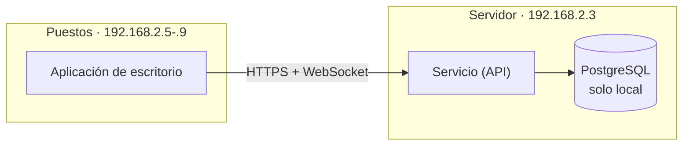

<!--
  PORTADA DEL REPOSITORIO PÚBLICO DE DESCARGAS.

  No se edita allí: el trabajo `publicar` de .github/workflows/instaladores.yml copia este archivo
  como README.md del repositorio público en cada release, junto con la licencia, la documentación y
  los guiones de instalación. Cualquier cambio hecho a mano en el otro repositorio se pierde en la
  siguiente publicación; se edita aquí.
-->

<div align="center">


# JudoAdministración

**Gestión completa de competiciones de judo: inscripción, pesaje, sorteo, combates e informes.**

[](../../releases/latest)
[](LICENSE)
[](#instalación)

</div>

---

## Qué es

Una aplicación de escritorio para dirigir una competición de judo de principio a fin, pensada para
usarse **en el pabellón el día del campeonato**: varios puestos de trabajo conectados a un servidor
local, sin depender de Internet.

Cubre el recorrido completo de un evento:

| Módulo | Qué hace |
|---|---|
| **Eventos** | Alta de campeonatos, categorías, tatamis y sistemas de competición. Exportación e importación |
| **Participantes** | Inscripción, edición, listados y resúmenes por club, categoría y peso |
| **Pesaje** | Registro de pesos, control de fallidos y reubicación automática de categoría |
| **Sorteo** | Emparejamiento por sistema (eliminatoria, liga, repesca, doble liga) y orden de salida |
| **Combates** | Cuadros por tatami, resultados y avance automático de rondas |
| **Informes** | Medallero, estadísticas, hojas de pesos, agenda de tatami y cuadros de combate en PDF |

Todo lo que se genera en papel (cuadros, actas, medalleros) sale en **PDF listo para imprimir**, con
vista previa dentro de la propia aplicación.

## Cómo funciona



Un equipo hace de **servidor**: es el único que guarda los datos y el único que abre la base de
datos. El resto son **puestos** que se conectan a él por la red local. Los cambios aparecen al
instante en todos los puestos, y si dos personas editan lo mismo a la vez el conflicto se avisa en
lugar de perderse un dato.

## Instalación

Descarga el paquete de tu sistema desde la [**última versión**](../../releases/latest):

| Equipo | Qué instalar | Windows | macOS | Linux |
|---|---|---|---|---|
| **Servidor** | Servicio (API) | `.zip` | `.tar.gz` | `.tar.gz` |
| **Puestos** | Aplicación de escritorio | `.exe` | `.dmg` | `.AppImage` |

> El equipo servidor necesita **los dos** paquetes si además es el que dirige la competición.

Los paquetes son **autocontenidos**: no hace falta instalar .NET en ningún equipo. Sí hace falta
PostgreSQL 18, pero sólo en el servidor.

Son **dos órdenes, sin parámetros**. Los guiones vienen dentro del propio paquete del servicio: no
hay que descargar nada más.

**1. En el servidor**, con el paquete descomprimido en `/opt/judoadministracion-api` (o
`C:\Program Files\JudoAdministracionServidor`):

```bash
sudo ./preparar-servidor.sh
```

Instala PostgreSQL si falta, crea la base de datos y los roles, emite el certificado HTTPS, crea el
esquema con sus datos básicos, configura el servicio y la aplicación de ese equipo, abre el puerto en
el cortafuegos y deja la API arrancando sola al encender. Al terminar deja una carpeta
**`judo-puestos/`** con el certificado y los guiones que hacen falta en el resto de equipos.

**2. En cada puesto**, con la aplicación instalada y esa carpeta en un USB:

```bash
sudo ./configurar-red.sh          # dirección IP fija
sudo ./preparar-puesto.sh         # certificado, nombre y comprobación de que llega al servidor
```

Los dos se deshacen con `--deshacer`, que devuelve el equipo a como estaba: importante cuando el
portátil es prestado.

Lo único que queda por hacer a mano es dar de alta los usuarios. El proceso completo, y qué hacer
cuando algo falla, está en la
**[Guía de instalación](Documentación/01-Guía-de-Instalación.md)**.

> **Windows.** PowerShell no ejecuta guiones `.ps1` con la directiva que trae de fábrica («la
> ejecución de scripts está deshabilitada en este sistema»). Se lanzan igual, desde PowerShell
> abierto como administrador:
> `powershell -ExecutionPolicy Bypass -File .\preparar-servidor.ps1`.
> Eso vale sólo para esa ejecución; no cambia la configuración del equipo.

## Documentación

| Documento | Contenido |
|---|---|
| [01 · Guía de instalación](Documentación/01-Guía-de-Instalación.md) | Puesta en marcha del servidor y de los puestos, paso a paso |
| [02 · Red y direccionamiento IP](Documentación/02-Red-y-Direccionamiento-IP.md) | Direcciones, puertos y cortafuegos |
| [03 · Arquitectura cliente-servidor](Documentación/03-Arquitectura-Cliente-Servidor.md) | Cómo se reparten el trabajo el servicio y la aplicación |

## Soporte

¿Un fallo, una duda o una propuesta? Abre una
[**incidencia**](../../issues/new) describiendo qué ocurre, en qué sistema y con qué versión.

El desarrollo se lleva en un repositorio privado; este de aquí es el punto de descarga y el canal de
incidencias.

## Licencia

Software **de código propietario y uso gratuito**. Texto completo en **[LICENSE](LICENSE)**.

**Se permite**, gratis y sin límite de equipos, usuarios ni tiempo:

- Descargar, instalar y ejecutar el programa, incluso con fines profesionales o comerciales.
- Redistribuirlo **íntegro y sin modificar**, a título gratuito y conservando todos los avisos.

**No se permite** modificarlo, crear obras derivadas, distribuir versiones modificadas, republicarlo
en otro repositorio ni reutilizar partes de él en otros proyectos.

La **propiedad intelectual del programa es de Juan Cotolí San Félix**.

> **Marcas y logotipos.** Los escudos federativos que incluye la aplicación son propiedad de sus
> respectivas entidades y no están cubiertos por esta licencia.

Las bibliotecas de terceros que incorpora se rigen por sus propias licencias, detalladas en
[TERCEROS.md](TERCEROS.md).

---

<div align="center">
<sub>Hecho para el tatami. 🥋</sub>
</div>
